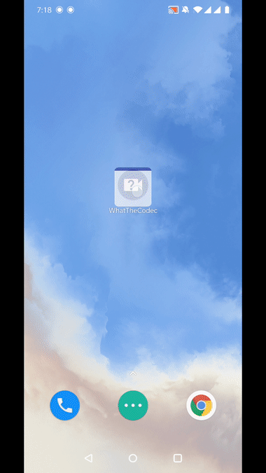
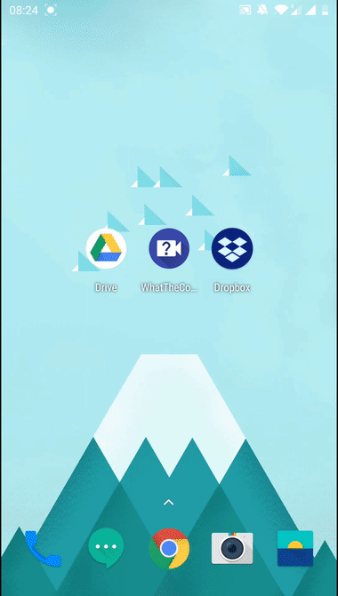

# What the Codec

This app shows information about all media streams inside a video or audio files.

For **video** streams the app shows: 
* File format name
* Video codec name 
* Frame size
* 1, 4 or 9 equidistant frames from the video stream

For **audio** streams: 
* Audio codec name
* Bit rate
* Number of channels
* Channel layout
* Sample rate and format

For **subtitle** streams: title and language from stream’s metadata.
  
The main purpose is to show how to use the output of [ffmpeg-android-maker](https://github.com/Javernaut/ffmpeg-android-maker).

Extensive description can be found in [this article](https://proandroiddev.com/a-story-about-ffmpeg-in-android-part-ii-integration-55fb217251f0).

Have a look at the app yourself:

# How does it work?

The codebase has a native part that glues FFmpeg libs to JVM part.  

FFmpeg accepts 2 types of input: File paths and File Descriptors. **File paths** are better and allow the FFmpeg to use all the functionality it has. **File Descriptors** can be passed to FFmpeg via pipe protocol, but it has certain [problems](https://ffmpeg.org/ffmpeg-protocols.html#pipe) like inability to seek backward. That is why the number of frames shown when pipe protocol is used is limited to 4 only. File protocol doesn't have this problem.  

App uses ACTION_GET_CONTENT to pick video/* files. So it can accept files from many different apps. The app ignores Storage Access Framework as many of standard and 3rd party apps do. Also app can handle ACTION_VIEW, when a video file is opened from another app.  
 
App tries to recreate a raw file path from a Uri and pass it to FFmpeg. If it doesn't succeed, it falls back to File Descriptor way.  

The app is simply structured: it uses the MVVM approach with components from [AndroidX](https://developer.android.com/jetpack/androidx).   
  
The rest is pretty standard Android-related burden.  

And here is what it looks like:

| Video file with video, audio and subtitle streams | Audio file |
| :---:  | :---: |
|  |  |

| Handling ACTION_VIEW from Dropbox app | Picking file from Google Drive app |
| :---:  | :---: |
|  |  |

## Prerequisites

First, initialise the submodule:  

`git submodule update --init`  
  
Then you need to setup and execute the ffmpeg-android-maker's script. The command used to generate the Play Store build looks like this:

`./ffmpeg-android-maker.sh --enable-libdav1d`

More details can be found in [ffmpeg-android-maker](https://github.com/Javernaut/ffmpeg-android-maker) repository.  

## How to use

Just import in Android Studio and run.

## License

WhatTheCodec app's source code is available under the MIT license. See the `LICENSE.txt` file for more details.
