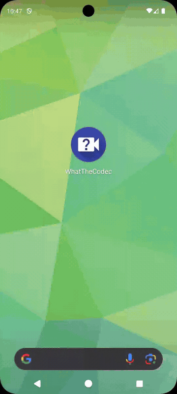
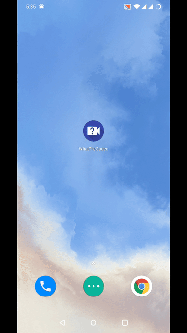
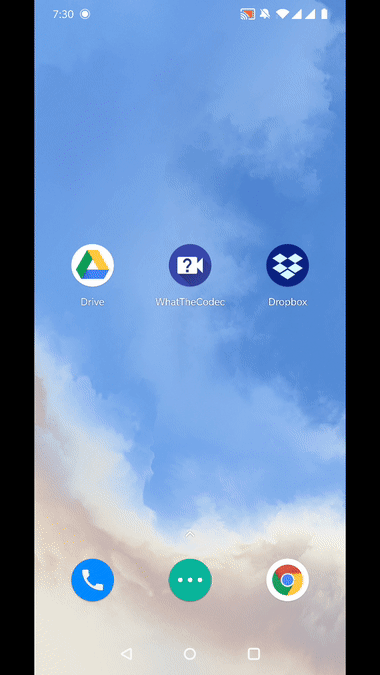
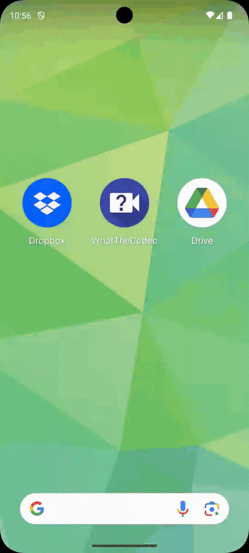

# What the Codec

This app shows information about all media streams inside a video or audio files.

The main purpose is to show how to use the output of [ffmpeg-android-maker](https://github.com/Javernaut/ffmpeg-android-maker) by using its wrapped version - [MediaFile](https://github.com/Javernaut/MediaFile) library.

Have a look at the app yourself:

&nbsp;
&nbsp;

Or see the gifs if it is more convenient:

| Video file with video, audio and subtitle streams | Audio file |
| :---: | :---: |
|  |  |

| Handling ACTION_VIEW from Dropbox app | Picking file from Google Drive app |
| :---: | :---: |
|  |  |

## License

WhatTheCodec app's source code is available under the MIT license. See the [LICENSE.txt](https://github.com/Javernaut/WhatTheCodec/blob/master/LICENSE.txt) file for more details.
