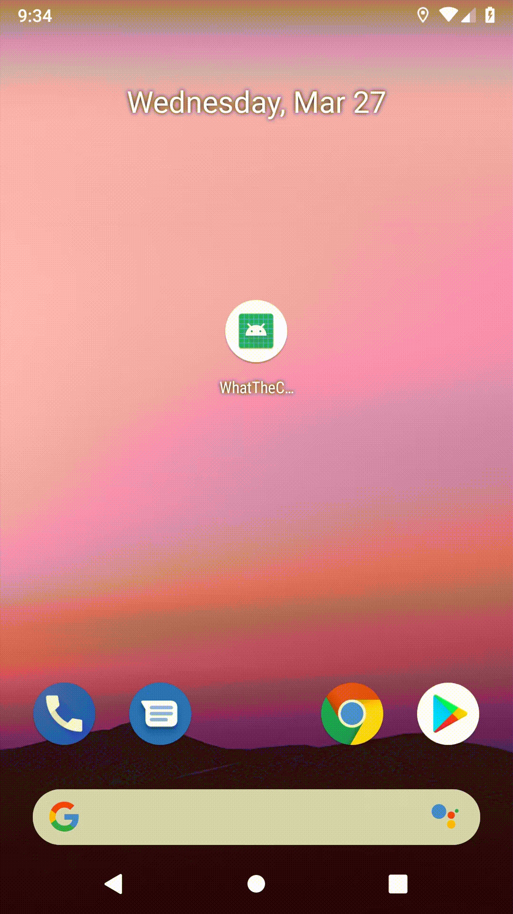

# What the Codec

A sample app that displays the name of a video codec used in a video file. The main purpose is to show how to use the output of [ffmpeg-android-maker](https://github.com/Javernaut/ffmpeg-android-maker). Basically is looks like this:  

  

## Prerequisites

First, initialise the submodule:  

`git submodule update --init`  
  
Then you need to setup and execute the ffmpeg-android-maker's script. More details can be found [here](https://github.com/Javernaut/ffmpeg-android-maker)  

## How to use

Just import in Android Studio and run.
