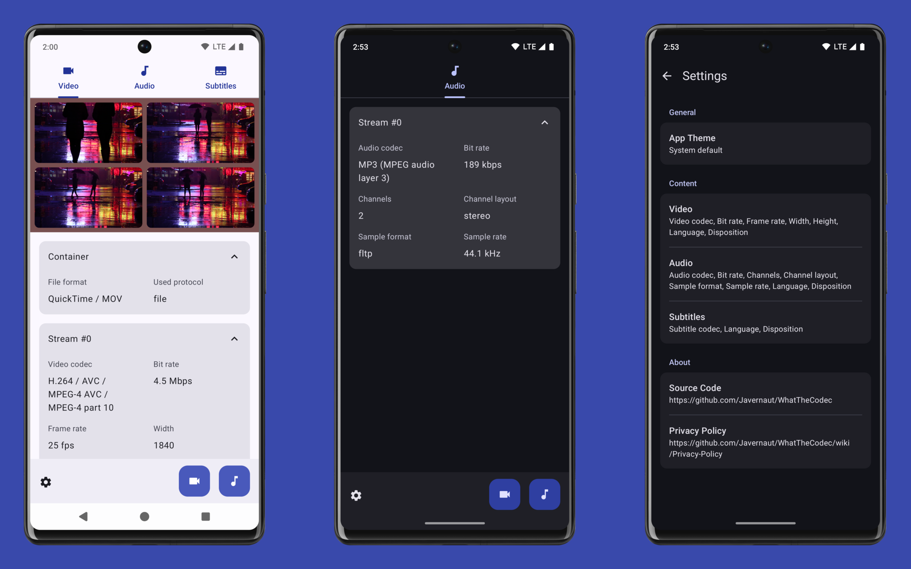

# WhatTheCodec

This app shows information about all media streams inside a video or audio files. It is available in these markets:

&nbsp;
&nbsp;

## Screenshots

## Technical overview

The main purpose of the app is to show how to use the output of [ffmpeg-android-maker](https://github.com/Javernaut/ffmpeg-android-maker) by using its wrapped version - [MediaFile](https://github.com/Javernaut/MediaFile) library.

Main features:
- Single Activity with Jetpack Compose for the whole UI and Navigation
- Dagger/Hilt for DI
- DataStore for settings storing
- Dependabot and Github Actions for automating some housekeeping, static analysis, release management

## License

WhatTheCodec app's source code is available under the MIT license. See the [LICENSE.txt](https://github.com/Javernaut/WhatTheCodec/blob/main/LICENSE.txt) file for more details.
